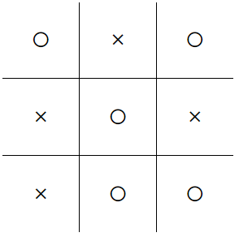

Essa é a tentativa de fazer um jogo da velha funcional, sem ultilizar códigos prontos...

-- Esse ReadMe servira para relatar a minha jornada durante a produção de projeto

09/08/2024 - Santo andré
Hoje eu inicio esse projeto, a ideia é fazer o código sem "Roubar" de ninguem.
  - Hoje fiz a parte vizual do jogo, entao inclui os "X" e a "O" para representar uma jogada, e deixar o jogo um pouco mais elegante.
  - Além de explicar para o meu professor qual a minha ideia para verificar se alguem ganhou

  Atualmente a ideia é o seguinte:
  
  O = 1
  X = 2

  

  Se em uma linha a soma for igual a 4 ou 5,´será um empate visto que um empate só pode ser constituido por:
    X|X|O = 5
    O|X|O = 4
  
  Caso a soma da linha de 3 ou 6, isso será uma vitória, visto que a vitória só pode ser constituida por:
    O|O|O = 3
    X|X|X = 6

  Entao o algoritomo irá fazer as somas de cada linha e coluna e entao ele fara a seguinte função:

  se {
    todas linhas, colunas ou diagonal for igual à 4 ou 5 = empate
  } Ou {
    se alguma linha, coluna ou diagonal for igual à 3 ou 6 = vitoria
    se {
      vitoria = 3
      circulo ganhou
    } entao {
      X ganhou
    }
  }