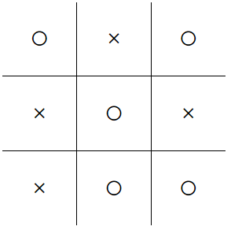

Essa é a tentativa de fazer um jogo da velha funcional, sem ultilizar códigos prontos ou inteligencia artificial, apenas meu conhecimento!

  ### Atualmente a ideia é o seguinte:
  
  - O = 1 
  - X = 2

  

  Se em uma linha a soma for igual à 4 ou 5, será um empate visto que um empate só pode ser constituido por: 
    X|X|O = 5 
    O|X|O = 4
  
  Caso a soma da linha seja igual à 3 ou 6, isso será uma vitória, visto que a vitória só pode ser constituida por: 
    O|O|O = 3 
    X|X|X = 6

  Entao o algoritomo irá fazer as somas de cada linha e coluna e entao ele fara a seguinte função:

  
  
    se (jogo completo){    
      Todas linhas, colunas ou diagonais for igual à 4 ou 5 = empate
      //Verifica a condição do jogo
      } Ou {
        Todas linhas, colunas ou diagonais for igual à 3 ou 6 = vitória
        //Verifica a condição do jogo
      }
    }
    se (Vítoria){
      vitória = 3
      circulo ganhou
    } ou {
      X ganhou
      //Se circulo nao ganhou, logo X ganhou, assim não é necessário verificar se Vitória = 6.
    }
  

  

